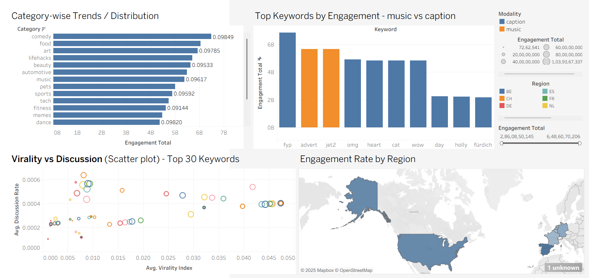

# Tiktok Trending Keywords Extraction Pipeline

This project builds an **end-to-end pipeline** for detecting trending tiktok keywords using
- **Scraping**
- **Multimodal processing (with Spark support)**
- **Database storage (POstgres/TimescaleDB)**
- **Airflow Orchestration**
- **Growth detection & Metrics**
- **API & Dashboard visualization**

It supports running both with Docker (recommended) and without a docker (using a single python environment)
 
----

## 📂 Project Structure
```
tiktok-keyword-system/
│
├── src/
│   ├── scraper/
│   │   ├── scraper1.py
│   │   ├── requirements_scraper.txt
│   │   ├── Dockerfile
│   │   └── tiktok_trending.json          # output of scraper
│   │
│   ├── multi_modal/
│   │   ├── multimodal_pipeline.py
│   │   ├── multimodal_spark.py
│   │   ├── preprocess.py
│   │   ├── requirements_spark.txt
│   │   ├── Dockerfile
│   │   └── wait-for-it.sh
│   │
│   ├── growth/
│   │   └── growth_detection.py
│   │
│   ├── metrics/
│   │   └── metrics_collector.py
│   │
│   ├── evaluation/
│   │   └── backtesting.py
│   │
│   ├── database/
│   │   ├── full_file.sql                 # TimescaleDB schema
│   │   └── README.md
│   │
│   ├── airflow_dags/
│   │   ├── dags/
│   │   │   └── tiktok_pipeline_dag.py
│   │   ├── requirements_dag.txt
│   │   └── Dockerfile
│   │
│   ├── api/
│   │   ├── streamlit_app.py
│   │   ├── requirements_api.txt
│   │   └── Dockerfile
│   │
│   └── dashboard/
│       ├── Book2.twb  # Tableau Dashboard
        └── tiktok_analysis.png  # Sample dashboard
│
├── docker-compose.yml
├── requirements_all.txt
├── README.md
├── .gitignore
├── .env
```

--- 

## ⚡ Workflow Overview

- **Scraper (`scraper1.py`)**
  - Collects trending TikTok video metadata.
  - Saves as `tiktok_trending.json`.

- **Multimodal Pipeline (`multimodal_pipeline.py` / `multimodal_spark.py`)**
  - Processes video metadata → extracts keywords, embeddings, features from multiple modalities like text, audio, OCR, image.
  - Outputs `keywords.csv`.

- **Preprocessing (`preprocess.py`)**
  - Cleans `keywords.csv`.
  - Saves as `keywords_clean.csv`.

- **Database (TimescaleDB/Postgres)**
  - Stores keywords and metadata.
  - Provides hypertables, indexes, and rollups.

- **Metrics, growth, evaluation (`growth_detection.py`, `backtesting.py`, `metrics_collector.py`)**
  - Backtesting: Testing with historical data.
  - Growth: Growth detection with threshold and engagement variables.
  - Metrics: Unique keywords, keywords extracted metrics extracted.

- **API, Dashboard (Tableau, Streamlit with FastAPI)**
  - Tableau Dashboard is created using `keywords_clean.csv` file.
  - Visualizes top keywords, engagement rates, virality vs discussion, and category metrics.
  - Streamlit also does the same thing to be interactive.


## Running without docker

### 1. Setup virtual environment and install dependencies
```bash
python3 -m venv venv
source venv/bin/activate    # Linux/Mac
venv\Scripts\activate       # Windows
pip install --upgrade pip
pip install -r requirements_all.txt
```

### 2. Run components
- **Scraper**: Run the scraper to fetch trending tiktok videos.
  ```bash
  python src/scraper/scraper1.py
  ```

- **Multimodal Pipeline**: Generates keywords and saves it into database and csv files.
  ```bash
  python src/multi_modal/multimodal_pipeline.py
  ```

- **Process Keywords**: Extracts some more metrics for business analytics.
  ```bash
  python src/multi_modal/preprocess.py keywords.csv keywords_clean.csv
  ```

- **Run Spark-based Multimodal (optional)**
  ```bash
  python src/multi_modal/multimodal_spark.py
  ```

- **Start Streamlit API**
  ```bash
  streamlit run src/api/streamlit_app.py
  ```

- **Start FastAPI (optional)**
  ```bash
  uvicorn src/api/api:app --reload --port 8000

- **Database Initialization (PostgreSQL/TimescaleDB)**: Saved keywords to database
  ```bash
  psql -U <DB_USER> -d <DB_NAME> -f src/database/full_file.sql
  ```

## Running with Docker (Recommended)

### Quick start
You can start the entire TikTok pipeline (scraper, multimodal processing, Airflow DAGs, API/Streamlit, and database) with **one command**:

### 1. Build and start all services
```bash
docker-compose up --build
```

This will start:
- titkok-db: TimescaleDB
- airflow: Scheduler + Webserver
- scraper: TiktokAPI scraper
- multimodal: Multimodal pipeline (Spark optional)
- Shared volume (`shared-data`) for exchaning json/csv files between containers

### 2. Run airflow DAG
- Visit `http://localhost:8080` to access Airflow UI
- Trigger `tiktok_pipeline_dag` DAG manually or wait for daily schedule

### 3. Streamlit Dashboard
- Visit `http://localhost:8501`


# Docker Notes
- Volumes
```
| Service        | Volume Path (Container) | Notes                                         |
|----------------|------------------------|-----------------------------------------------|
| multimodal     | `/multimodal/data`     | Stores `keywords.csv` and `keywords_clean.csv` |
| api / streamlit| `/app/data`            | Reads `keywords_clean.csv` for visualization |
| scraper        | `/scraper/data`        | Stores `tiktok_trending.json`                |


```
- Shared volumes ensure containers can access generated files across services.

# Airflow DAG Overview
```
scraper -> multimodal_pipeline -> preprocess_keywords -> refresh_rollups -> compute_keyword_growth -> collect_pipeline_metrics
```
- Each step runs in its own container
- DAG ensures all dependencies execute in order.
- Spark-based multimodal can process large video datasets efficiently.

# Notes
- Ensure the `full_file.sql` schema works in a local TimescaleDB/Postgres instance before running Docker.
- Use the shared volumes properly to ensure JSON / CSV files are accessible in all containers.
- For local development, you can skip Docker and run components sequentially.


# Tableau Dashboard (Sample)

A sample Tableau dashboard has been created using `keywords_clean.csv` to provide **business analytics insights** on trending TikTok keywords. This dashboard helps in visualizing metrics such as engagement, virality, and discussion trends across different categories.

### Metrics Visualized
1. **Category-wise Trends** – Understand which content categories are trending over time.
2. **Top Keywords** – Identify top-performing keywords based on engagement and growth.
3. **Virality vs Discussion** – Scatter plots to analyze which keywords are going viral versus generating discussion.
4. **Engagment by Region** - Region map showing engagment rate across mulitple regions.

### Dashboard Screenshot


> The dashboard was built using `keywords_clean.csv` generated by the multimodal pipeline. It can be updated regularly by re-running the pipeline.

# References: 
- [TiktokApi](https://github.com/davidteather/TikTok-Api): For Scraping
- [Multimodal]:
    - Text-based Extraction (NLP): [NLTK](https://github.com/nltk/nltk), [stopwordsiso](https://github.com/stopwords-iso/stopwords-iso)
    - Audio-based Extraction: [Whisper ASR](https://github.com/openai/whisper)
    - Visual Extraction (OCR): [Pytesseract](https://github.com/h/pytesseract)
    - Image captioning: [GPT2](https://huggingface.co/nlpconnect/vit-gpt2-image-captioning)
